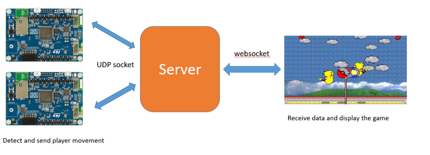

# 1092mbed_final_project
Modify from [https://github.com/NTUEE-ESLab/2020-Pikachu-volleyball](https://github.com/NTUEE-ESLab/2020-Pikachu-volleyball)

## Main Architecture
\
Take from [https://github.com/NTUEE-ESLab/2020-Pikachu-volleyball](https://github.com/NTUEE-ESLab/2020-Pikachu-volleyball)

## Guide
`git clone https://github.com/finalwee/1092mbed_final_project.git`
Clone the whole repository to your local place.

### Build Web game
`cd pikachu-volleyball && npm install`\
or\
`cd pikachu-volleyball` then `npm install`\
Install all modules required by pikachu-volleyball. If you get any errors, pls fix them.

### Python Server
Make sure your device can run python. If not, pls set up your python first. Recommend [python3](https://www.python.org/downloads/).
`pip3 install websockets`\
Install websockets module. If you are missing any module, pls install it.

### STM32
Import by URL: https://github.com/finalwee/STM32-pikavolley.
After that, write the program into STM32.

## Start Up
Please make sure, all pre-build is done.

### 1. Start Python Server
1 player: `python3 ws_server_1p.py`\
If want to add the second player `ws_server_2p.py`

### 2. Start Web Game
`cd pikachu-volleyball && npm start`\
or\
`cd pikachu-volleyball` then `npm start`\
Open [http://localhost:8080](http://localhost:8080) to view it in the browser.

### 3. Power on STM32
Make sure you had written the right program into STM32. Please reference to [./STM32-pikavolley/README.md](./STM32-pikavolley/README.md) for the STM32 work logic.
